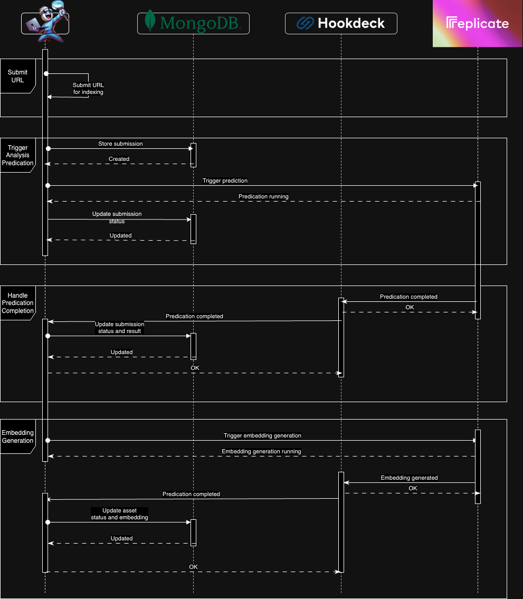
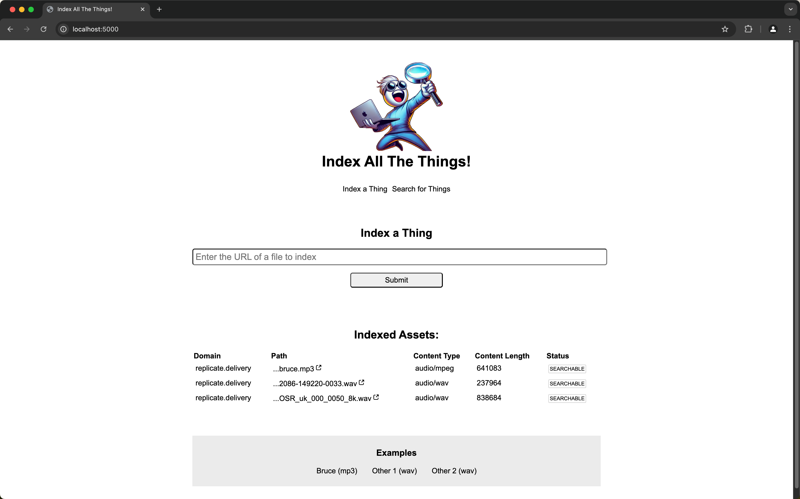
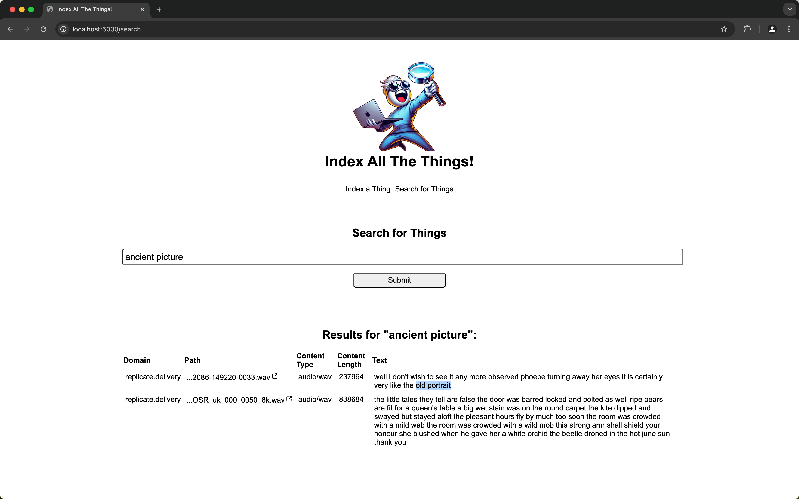

# Index All The Things!

<p align="center">

</p>

A Python web application built on Flask that allows an asset with a URL to be analyzed and a textual and embedding representation stored in [MongoDB Atlas](https://www.mongodb.com/atlas).

A vector search can then be performed on the embeddings.

The application uses [Replicate](https://replicate.com) to run AI models and [Hookdeck](https://hookdeck.com?ref=github-iatt) to reliability receive asynchronous results from Replicate.

At present the application supports analyzing audio assets and getting the transcribed contents. However, there is a framework in place to support other asset types such as text, HTML, images, and video

## How it works

The following diagram shows the sequence of how assets are submitted within the Flask application and processed by Replicate, and the results sent via webhooks through Hookdeck back to the Flask application and stored in MongoDB.



## Prerequisites

- A free [Hookdeck account](https://dashboard.hookdeck.com/signup?ref=github-iatt)
- The [Hookdeck CLI installed](https://hookdeck.com/docs/cli?ref=github-iatt)
- A trial [MongoDB Atlas account](https://www.mongodb.com/cloud/atlas/register)
- A [Replicate account](https://replicate.com/signin)
- [Python 3](https://www.python.org/downloads/)
- [Poetry](https://python-poetry.org/docs/#installation) for package management

## Development setup

### Dependencies

Activate the virtual environment:

```sh
poetry shell
```

Install dependencies:

```sh
poetry install
```

### Configuration

Create a `.env` file with the following configuration, replacing with values as indicated:

```
# A secret used for signing session cookies
# https://flask.palletsprojects.com/en/2.3.x/config/#SECRET_KEY
SECRET_KEY=""

# MongoDB Atlas connection string
MONGODB_CONNECTION_URI=""

# Hookdeck Project API Key
# Hookdeck Dashboard -> Settings -> Secrets
HOOKDECK_PROJECT_API_KEY=""

# Replicate API Token
REPLICATE_API_TOKEN=""

# Hookdeck Source URLs
# These will be automatically populated for you in the next step
AUDIO_WEBHOOK_URL=""
EMBEDDINGS_WEBHOOK_URL=""
```

Run the following to create Hookdeck connections to receive webhooks from Replicate:

```sh
poetry run python create-hookdeck-connections.py
```

Run the following to create a Vector Index within MongoDB:

> [!WARNING]
> You may need some data within MongoDB before you can create the vector index.

```sh
poetry run python create-vector-index.py
```

### Run the app

Run the app:

```sh
poetry run python -m flask --app app --debug run
```

Create localtunnels to receive webhooks from the two Hookdeck Connections:

```sh
hookdeck listen '*' 5000
```

Navigate to `localhost:5000` within your web browser.





## Learn more

- [Hookdeck docs](https://hookdeck.com/docs?ref=github-)